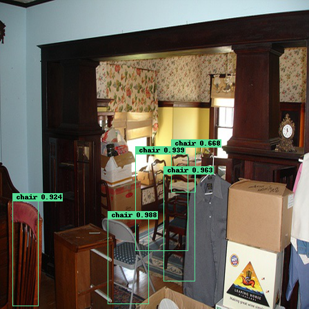
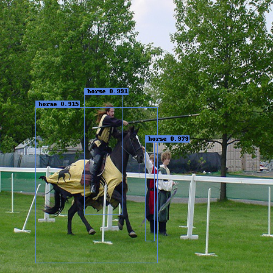

# object-detection-torch
object detection by yolo with pytorch

## 概要
物体検出モデル及び一連のスクリプトを`pytorch`をベースにして作成する。

## 使用するデータセット
PASCAL VOC (Visual Object Classes) 2007, 2012を使用。

[参考ブログ](https://www.sigfoss.com/developer_blog/detail?actual_object_id=247)
> Pascal VOC 2007および2012の16,551枚のtrainval画像を用いて学習し、Pascal VOC 2007の4,952枚のtest画像を用いて評価する手法を使っていくことにします。

この方法を参考にしてみる。

学習データ：
- data/VOCdevkit/VOC2007/ImageSets/Main/trainval.txt
- data/VOCdevkit/VOC2012/ImageSets/Main/trainval.txt

テストデータ：
- data/VOCdevkit/VOC2007/ImageSets/Main/test.txt

## 推論結果・評価結果
### 学習データ
学習自体は進んでいるようである。



ただし、bbox の判定が上手く行っても class の判定に失敗しているケースが多く見られた。



### テストデータ
テストデータでの推論はあまり良い結果にならなかった。

定量的な評価は以下の通り。（2020.6.16時点）<br>
50epoch実施した結果であるが、全体的にscoreは低かった。<br>
原因については調査が難しいため、一旦保留とする。
|label|average precision|average recall|
|-|-|-|
|aeroplane|0.376|0.206|
|bicycle|0.418|0.215|
|bird|0.111|0.031|
|boat|0.054|0.023|
|bottle|0.05|0.003|
|bus|0.229|0.162|
|car|0.402|0.153|
|cat|0.241|0.168|
|chair|0.018|0.006|
|cow|0.086|0.019|
|diningtable|0.081|0.003|
|dog|0.222|0.13|
|horse|0.036|0.048|
|motorbike|0.182|0.083|
|person|0.265|0.124|
|pottedplant|0.02|0.002|
|sheep|0.054|0.006|
|sofa|0.067|0.006|
|train|0.211|0.101|
|tvmonitor|0.098|0.008|
|**mean**|**0.161**|**0.075**|

## スクリプト構成
```
src
├dataset.py     ・・・元データの加工・データセットのクラス
├labelmap.json  ・・・検出対象の一覧
├loss.py        ・・・損失関数の定義
├model.py       ・・・モデルの定義
├train.py       ・・・学習用のスクリプト
├eval.py        ・・・評価用のスクリプト
└inference.py   ・・・推論用のスクリプト
```

## 処理実施手順
### 1. 環境構築
本スクリプトはEC2(p2.xlarge)での実施を想定している。

インスタンス起動後、[ここ](https://github.com/rs1004/semantic-segmentation-tf2/blob/master/setup.md)を参考に GPU 設定、Docker 設定を行う。

### 2. Docker ビルド・起動
以下でDockerをビルド・起動する。
```
docker build -t gpu_env --rm=true docker/
docker run --shm-size=20g --gpus all -it --rm -v /work/object-detection-torch/:/work --name od gpu_env
```

### 3. 学習実行
学習は `train.py` で行う。以下実行時のパラメータを記載。
```
usage: train.py [-h] [--imsize IMSIZE] [--grid_num GRID_NUM]
                [--bbox_num BBOX_NUM] [--class_num CLASS_NUM]
                [--l_coord L_COORD] [--l_noobj L_NOOBJ]
                [--batch_size BATCH_SIZE] [--epochs EPOCHS]
                [--save_period SAVE_PERIOD] [--save_path SAVE_PATH]

optional arguments:
  -h, --help            show this help message and exit
  --imsize IMSIZE
  --grid_num GRID_NUM
  --bbox_num BBOX_NUM
  --class_num CLASS_NUM
  --l_coord L_COORD
  --l_noobj L_NOOBJ
  --batch_size BATCH_SIZE
  --epochs EPOCHS
  --save_period SAVE_PERIOD
  --save_path SAVE_PATH
```
`batch_size`, `epochs` 以外はデフォルト値を想定。

### 4. 評価実行
評価は `evaluate.py` で行う。以下実行時のパラメータを記載。
```
usage: evaluate.py [-h] [--imsize IMSIZE] [--grid_num GRID_NUM]
                   [--bbox_num BBOX_NUM] [--class_num CLASS_NUM]
                   [--batch_size BATCH_SIZE]
                   [--model_weights_path MODEL_WEIGHTS_PATH]
                   [--evaluation_dir EVALUATION_DIR]

optional arguments:
  -h, --help            show this help message and exit
  --imsize IMSIZE
  --grid_num GRID_NUM
  --bbox_num BBOX_NUM
  --class_num CLASS_NUM
  --batch_size BATCH_SIZE
  --model_weights_path MODEL_WEIGHTS_PATH
  --evaluation_dir EVALUATION_DIR
```

### 4. 推論実行
評価は `inference.py` で行う。以下実行時のパラメータを記載。
```
usage: inference.py [-h] [--inference_num INFERENCE_NUM] [--imsize IMSIZE]
                    [--grid_num GRID_NUM] [--bbox_num BBOX_NUM]
                    [--class_num CLASS_NUM] [--batch_size BATCH_SIZE]
                    [--model_weights_path MODEL_WEIGHTS_PATH]
                    [--inference_out_dir INFERENCE_OUT_DIR]

optional arguments:
  -h, --help            show this help message and exit
  --inference_num INFERENCE_NUM
  --imsize IMSIZE
  --grid_num GRID_NUM
  --bbox_num BBOX_NUM
  --class_num CLASS_NUM
  --batch_size BATCH_SIZE
  --model_weights_path MODEL_WEIGHTS_PATH
  --inference_out_dir INFERENCE_OUT_DIR
```
`inference_num` 以外はデフォルト値を想定。
